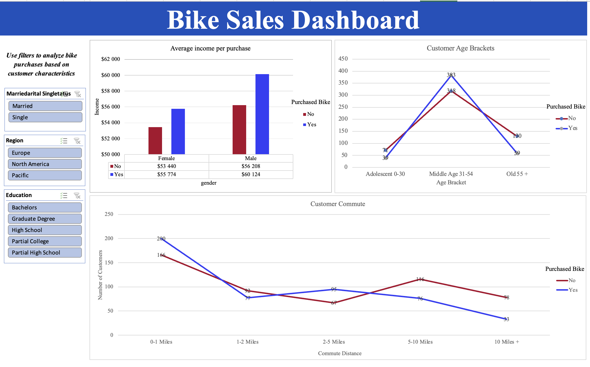

# 🚴 **Bike Sales Dashboard**  
### 📊 *Analyzing Customer Insights & Purchasing Behavior*

---

## 📌 **Project Overview**
The **Bike Sales Dashboard** is an interactive and data-driven Excel dashboard designed to analyze customer purchasing behavior. It provides insights into **bike sales trends**, customer demographics, income levels, commute patterns, and purchasing preferences.

With the help of **Pivot Tables & Pivot Charts**, this dashboard offers an intuitive visualization of key sales data, allowing for better decision-making and trend analysis.

---

## 🎯 **Key Features**
✅ **Demographic Analysis** – Explore customer purchases based on **age, marital status, education, and region**.  
✅ **Income Insights** – Compare the **average income of customers** who purchased a bike versus those who didn’t.  
✅ **Commute Patterns** – Analyze how **commute distance** affects bike purchasing decisions.  
✅ **Interactive Filters** – Use slicers to filter data dynamically for a more personalized analysis.  
✅ **Professional Visualization** – Well-structured and aesthetically pleasing charts with color-coded data.  

---

## 📂 **Project Structure**
```
bike-sales-dashboard/
│── Bike_Sales_Dashboard.xlsx  # Main Excel dashboard file
│── README.md                  # Project description
│── dashboard_screenshot.png    # Screenshot of the final dashboard
│── data/                       # (Optional) Raw dataset folder
│── docs/                       # (Optional) Additional documentation
```

---

## 🖼 **Dashboard Preview**


---

## ⚙️ **Technology & Tools Used**
- **Microsoft Excel** – Pivot Tables, Pivot Charts, Data Analysis
- **Data Cleaning & Transformation** – Formatting raw data for meaningful insights
- **Visualization** – Custom charts, slicers, color themes

---

## 🚀 **How to Use**
1. **Download** the `Bike_Sales_Dashboard.xlsx` file.
2. Open it in **Microsoft Excel** (or any compatible spreadsheet software).
3. Use the **slicers** on the left to filter results based on customer characteristics.
4. Analyze the visualizations to gain insights into bike purchasing patterns.

---

## 📊 **Insights Gained from the Dashboard**
🔹 **Higher Income Customers** are more likely to purchase bikes.  
🔹 **Commute Distance Matters** – Customers commuting **0-1 miles** have the highest purchasing rate.  
🔹 **Middle-Aged Individuals (31-54)** are the most frequent bike buyers.  
🔹 **Marital & Education Status** impact purchasing decisions in surprising ways!  

---

## 🏆 **Why This Dashboard Stands Out?**
✅ **User-Friendly** – Designed for both beginners & data professionals.  
✅ **Visually Appealing** – High-contrast charts with clear labels & filters.  
✅ **Business-Driven** – Provides real-world business insights for marketing & sales teams.  

---

## 📩 **Contribute & Feedback**
🔹 If you find this dashboard useful, **star this repo ⭐**!  
🔹 Suggestions or improvements? **Open an issue** or submit a **pull request**.  
🔹 Feel free to **fork** and modify for your own dataset.  

